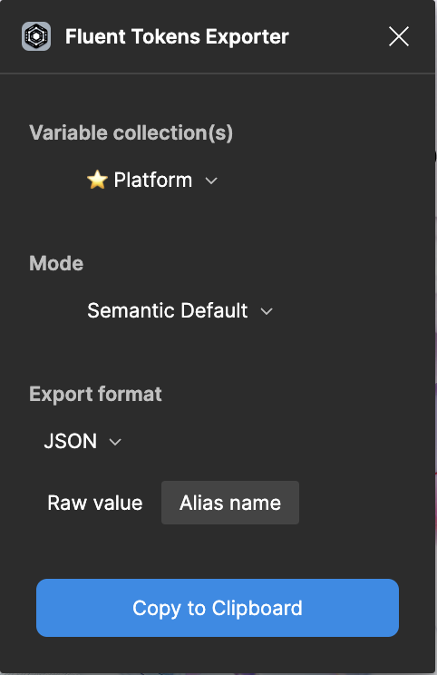

# Design Tokens

This package:
- Exports design tokens that can be injected in CSS via js.
- Provides information on how to map Fluent UI web component tokens to the new control tokens

## Figma

The figma exports located in the `./data` folder are generated using the [figma plugin](https://www.figma.com/community/plugin/1332869916969321981/fluent-tokens-exporter).

## Using the plugin

To generate files from the plugin, open the [fluent semantic token library](https://www.figma.com/design/QvbzVbuxcLKGMTNCHpAsjt/Fluent-Semantic-Token-Library?node-id=4-563&t=uKMfPS8QgInnje1m-0) fluent file first, then open the figma plugin, and select the fluent semantic token library to open it. You will need to open the figma file first to add it to the list.

## Semantic Token Mapping

This file is located at `./data/figma.ctrl-to-semantic-mapping.json`.

You will want to choose:

- Variable Collections: "Platform"
- Mode: "Semantic Default"
- Export Format: "JSON"
- From the switch: "Alias name"

## Kumo Value Mapping

The current value mapping is contained in the file `./src/ctrl.kumo.css`. This will change to the figma exports as the tokens are validated.